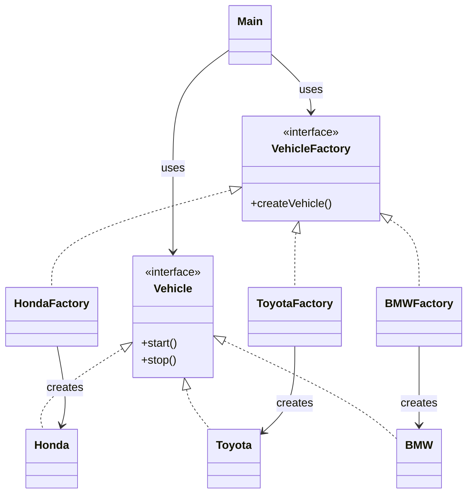

```mermaid
classDiagram

class Vehicle {
    <<interface>>
    +start()
    +stop()
}

class Honda
class Toyota
class BMW

Vehicle <|.. Honda
Vehicle <|.. Toyota
Vehicle <|.. BMW

class VehicleFactory {
    <<interface>>
    +createVehicle()
}

class HondaFactory
class ToyotaFactory
class BMWFactory

VehicleFactory <|.. HondaFactory
VehicleFactory <|.. ToyotaFactory
VehicleFactory <|.. BMWFactory

HondaFactory --> Honda : creates
ToyotaFactory --> Toyota : creates
BMWFactory --> BMW : creates

class Main

Main --> VehicleFactory : uses
Main --> Vehicle : uses
```