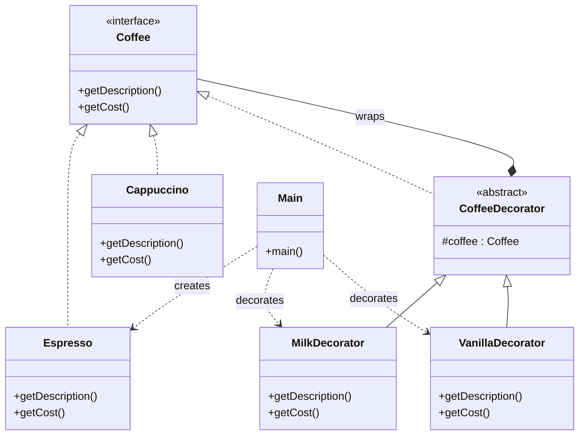

```mermaid
classDiagram

class Coffee {
    <<interface>>
    +getDescription()
    +getCost()
}

class Espresso {
    +getDescription()
    +getCost()
}

class Cappuccino {
    +getDescription()
    +getCost()
}

class CoffeeDecorator {
    <<abstract>>
    #coffee : Coffee
}

class MilkDecorator {
    +getDescription()
    +getCost()
}

class VanillaDecorator {
    +getDescription()
    +getCost()
}

class Main {
    +main()
}

Coffee <|.. Espresso
Coffee <|.. Cappuccino
Coffee <|.. CoffeeDecorator

CoffeeDecorator <|-- MilkDecorator
CoffeeDecorator <|-- VanillaDecorator

CoffeeDecorator *-- Coffee : wraps

Main ..> Espresso : creates
Main ..> MilkDecorator : decorates
Main ..> VanillaDecorator : decorates
```