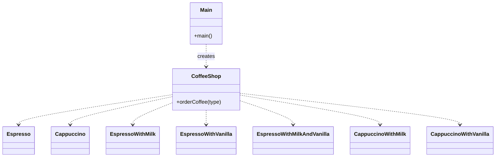

```mermaid
classDiagram

class CoffeeShop {
    +orderCoffee(type)
}

class Espresso
class Cappuccino
class EspressoWithMilk
class EspressoWithVanilla
class EspressoWithMilkAndVanilla
class CappuccinoWithMilk
class CappuccinoWithVanilla

class Main {
    +main()
}

CoffeeShop ..> Espresso
CoffeeShop ..> Cappuccino
CoffeeShop ..> EspressoWithMilk
CoffeeShop ..> EspressoWithVanilla
CoffeeShop ..> EspressoWithMilkAndVanilla
CoffeeShop ..> CappuccinoWithMilk
CoffeeShop ..> CappuccinoWithVanilla

Main ..> CoffeeShop : creates
```