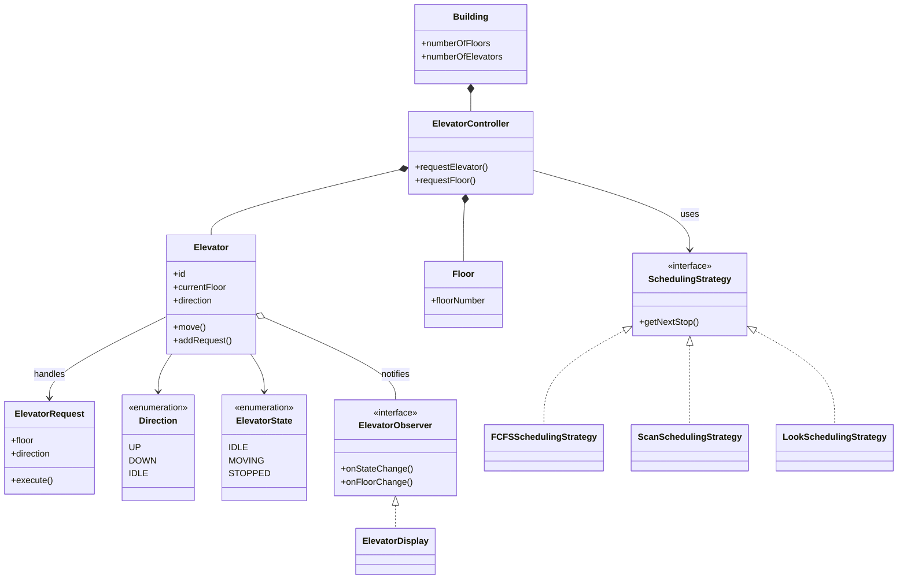

```mermaid
classDiagram

%% ENUMS
class Direction {
    <<enumeration>>
    UP
    DOWN
    IDLE
}

class ElevatorState {
    <<enumeration>>
    IDLE
    MOVING
    STOPPED
}

%% CORE CLASSES
class Building {
    +numberOfFloors
    +numberOfElevators
}

class ElevatorController {
    +requestElevator()
    +requestFloor()
}

class Elevator {
    +id
    +currentFloor
    +direction
    +move()
    +addRequest()
}

class Floor {
    +floorNumber
}

class ElevatorRequest {
    +floor
    +direction
    +execute()
}

%% STRATEGY PATTERN
class SchedulingStrategy {
    <<interface>>
    +getNextStop()
}

class FCFSSchedulingStrategy
class ScanSchedulingStrategy
class LookSchedulingStrategy

SchedulingStrategy <|.. FCFSSchedulingStrategy
SchedulingStrategy <|.. ScanSchedulingStrategy
SchedulingStrategy <|.. LookSchedulingStrategy

%% OBSERVER PATTERN
class ElevatorObserver {
    <<interface>>
    +onStateChange()
    +onFloorChange()
}

class ElevatorDisplay

ElevatorObserver <|.. ElevatorDisplay

%% RELATIONSHIPS
Building *-- ElevatorController
ElevatorController *-- Elevator
ElevatorController *-- Floor

ElevatorController --> SchedulingStrategy : uses
Elevator --> ElevatorRequest : handles

Elevator --> Direction
Elevator --> ElevatorState

Elevator o-- ElevatorObserver : notifies
```