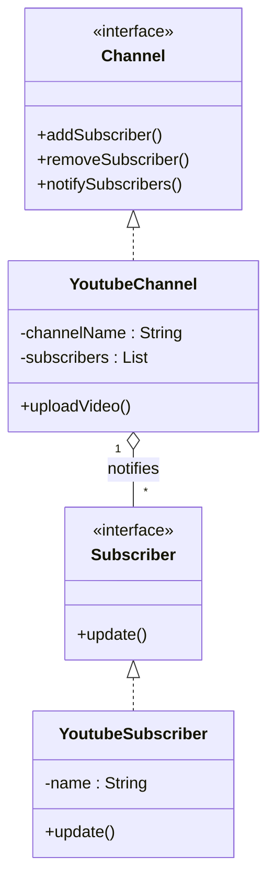

```mermaid
classDiagram

class Channel {
    <<interface>>
    +addSubscriber()
    +removeSubscriber()
    +notifySubscribers()
}

class YoutubeChannel {
    -channelName : String
    -subscribers : List<Subscriber>
    +uploadVideo()
}

class Subscriber {
    <<interface>>
    +update()
}

class YoutubeSubscriber {
    -name : String
    +update()
}

Channel <|.. YoutubeChannel
Subscriber <|.. YoutubeSubscriber

YoutubeChannel "1" o-- "*" Subscriber : notifies
```