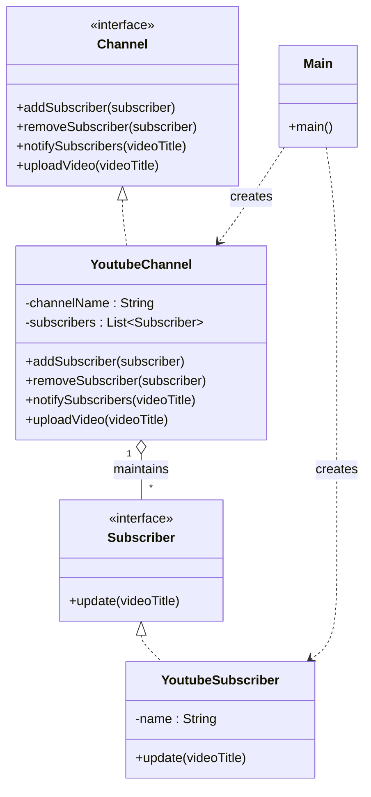

```mermaid
classDiagram

class Channel {
    <<interface>>
    +addSubscriber(subscriber)
    +removeSubscriber(subscriber)
    +notifySubscribers(videoTitle)
    +uploadVideo(videoTitle)
}

class Subscriber {
    <<interface>>
    +update(videoTitle)
}

class YoutubeChannel {
    -channelName : String
    -subscribers : List~Subscriber~
    +addSubscriber(subscriber)
    +removeSubscriber(subscriber)
    +notifySubscribers(videoTitle)
    +uploadVideo(videoTitle)
}

class YoutubeSubscriber {
    -name : String
    +update(videoTitle)
}

class Main {
    +main()
}

Channel <|.. YoutubeChannel
Subscriber <|.. YoutubeSubscriber

YoutubeChannel "1" o-- "*" Subscriber : maintains

Main ..> YoutubeChannel : creates
Main ..> YoutubeSubscriber : creates
```