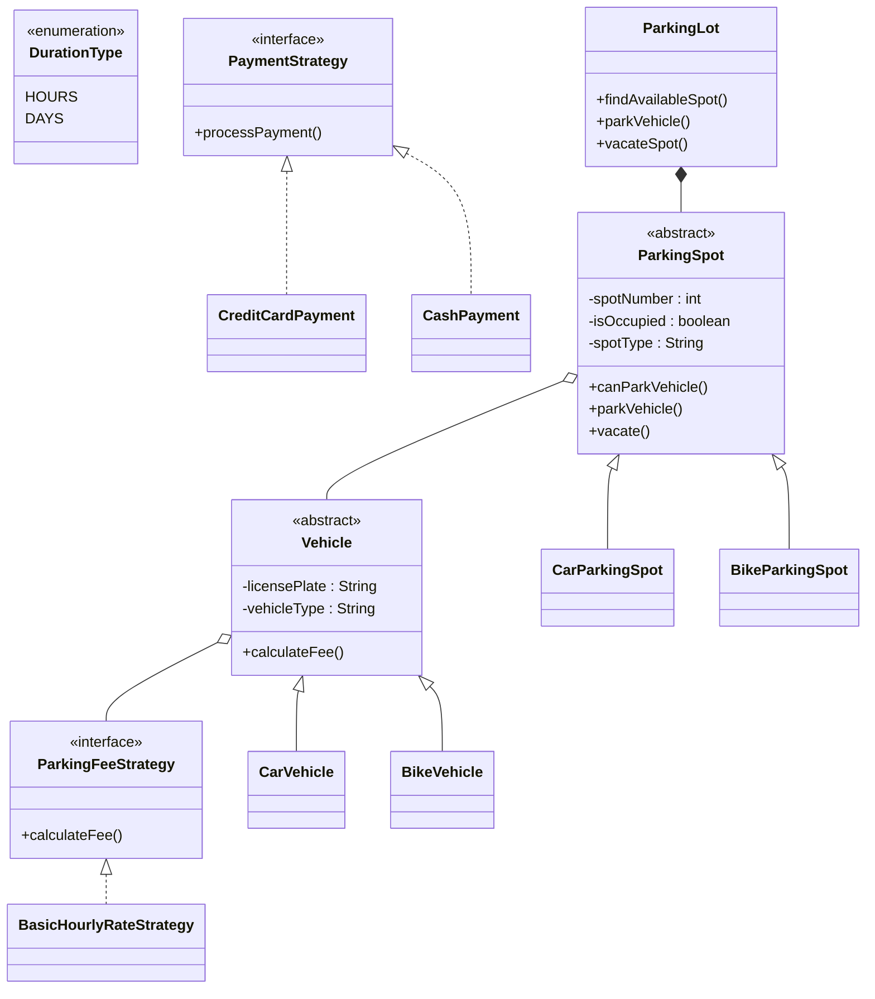

```mermaid
classDiagram

class DurationType {
    <<enumeration>>
    HOURS
    DAYS
}

class ParkingFeeStrategy {
    <<interface>>
    +calculateFee()
}

class PaymentStrategy {
    <<interface>>
    +processPayment()
}

class BasicHourlyRateStrategy
class CreditCardPayment
class CashPayment

class Vehicle {
    <<abstract>>
    -licensePlate : String
    -vehicleType : String
    +calculateFee()
}

class CarVehicle
class BikeVehicle

class ParkingSpot {
    <<abstract>>
    -spotNumber : int
    -isOccupied : boolean
    -spotType : String
    +canParkVehicle()
    +parkVehicle()
    +vacate()
}

class CarParkingSpot
class BikeParkingSpot

class ParkingLot {
    +findAvailableSpot()
    +parkVehicle()
    +vacateSpot()
}

ParkingFeeStrategy <|.. BasicHourlyRateStrategy

PaymentStrategy <|.. CreditCardPayment
PaymentStrategy <|.. CashPayment

Vehicle <|-- CarVehicle
Vehicle <|-- BikeVehicle

Vehicle o-- ParkingFeeStrategy

ParkingSpot <|-- CarParkingSpot
ParkingSpot <|-- BikeParkingSpot

ParkingSpot o-- Vehicle

ParkingLot *-- ParkingSpot
```