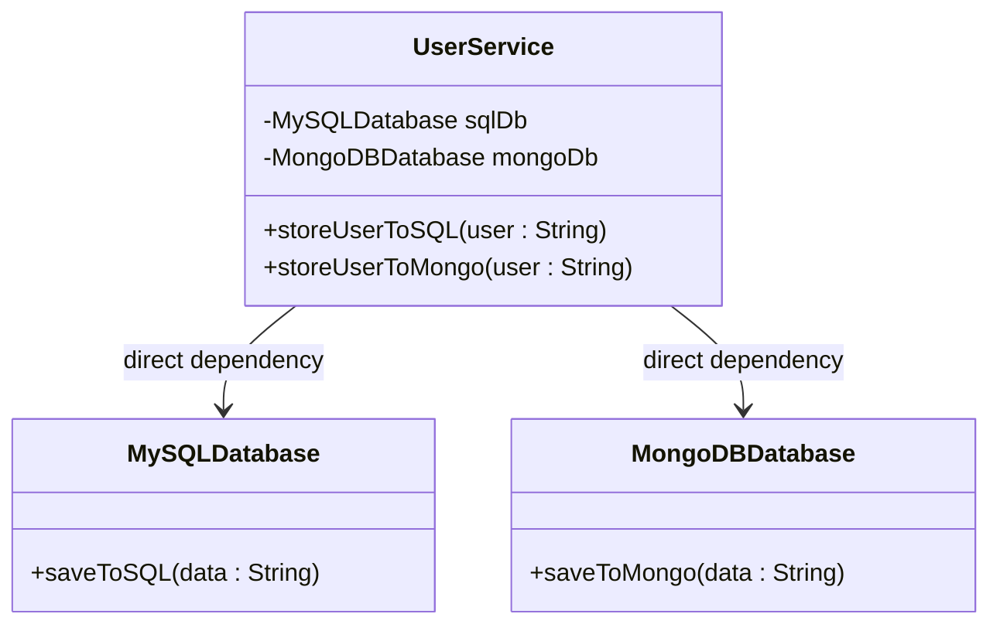
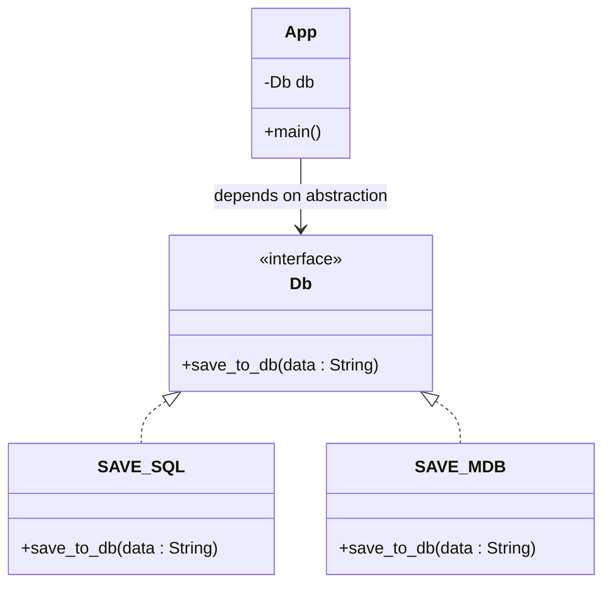

# DIP Violated

```mermaid
classDiagram

class MySQLDatabase{
    +saveToSQL(data : String)
}

class MongoDBDatabase{
    +saveToMongo(data : String)
}

class UserService{
    -MySQLDatabase sqlDb
    -MongoDBDatabase mongoDb
    +storeUserToSQL(user : String)
    +storeUserToMongo(user : String)
}

UserService --> MySQLDatabase : direct dependency
UserService --> MongoDBDatabase : direct dependency
```

**Problem:** UserService directly depends on concrete database classes.

---

# DIP Followed

```mermaid
classDiagram

class Db{
    <<interface>>
    +save_to_db(data : String)
}

class SAVE_SQL{
    +save_to_db(data : String)
}

class SAVE_MDB{
    +save_to_db(data : String)
}

class App{
    -Db db
    +main()
}

Db <|.. SAVE_SQL
Db <|.. SAVE_MDB

App --> Db : depends on abstraction
```

**Solution:** App depends on the `Db` interface rather than concrete implementations.