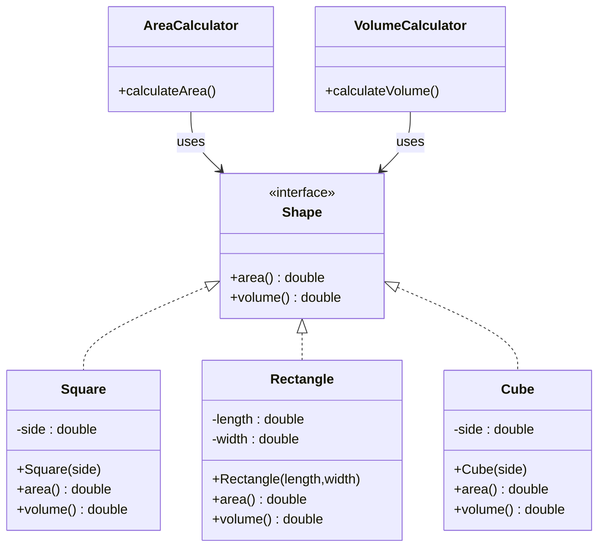
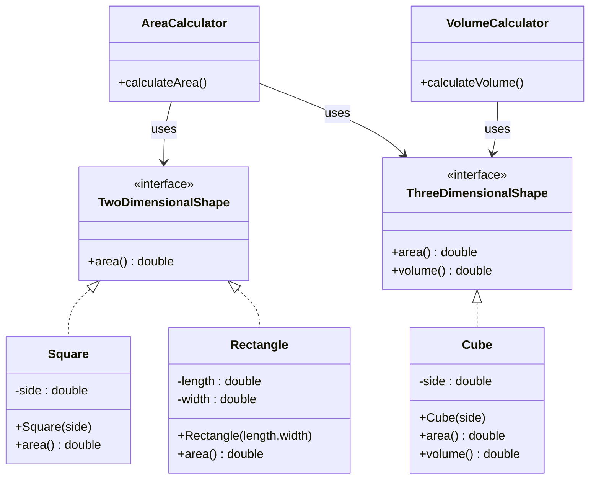

# ISP Violated

**Problem**

- `Square` and `Rectangle` are forced to implement `volume()`.
- `VolumeCalculator` assumes every `Shape` supports volume.
- Some implementations throw exceptions or contain dummy logic.
- Clients depend on methods they do not need.

---

# ISP Followed

**Benefit**

- `Square` and `Rectangle` only implement `area()`.
- `Cube` implements both `area()` and `volume()`.
- Clients depend only on the interfaces they actually need.
- No unnecessary methods, exceptions, or dummy implementations.