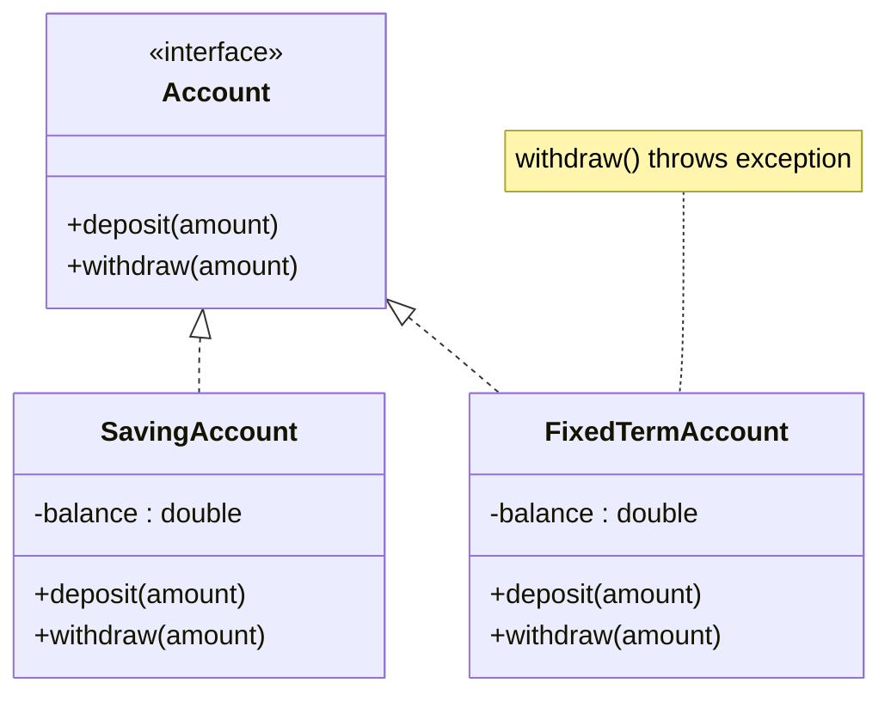
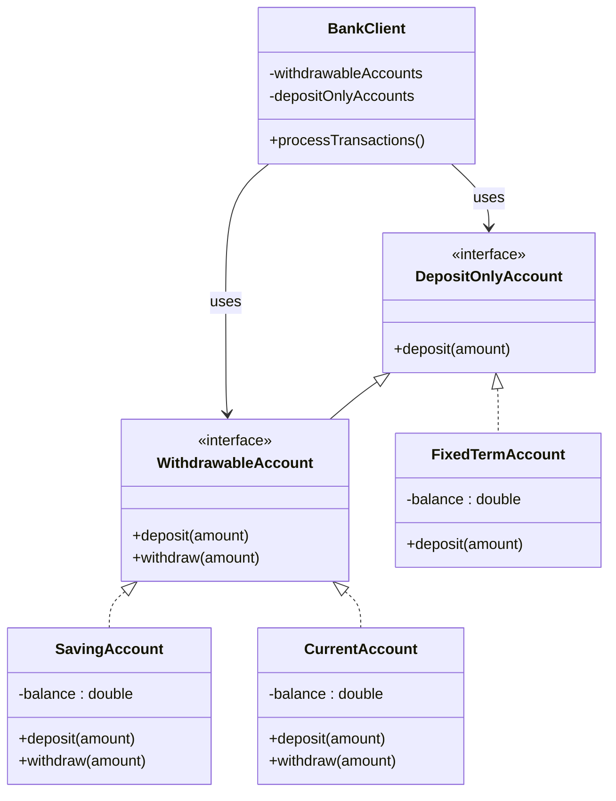

## LSP Violated

```mermaid
classDiagram

class Account {
    <<interface>>
    +deposit(amount)
    +withdraw(amount)
}

class SavingAccount {
    -balance : double
    +deposit(amount)
    +withdraw(amount)
}

class FixedTermAccount {
    -balance : double
    +deposit(amount)
    +withdraw(amount)
}

Account <|.. SavingAccount
Account <|.. FixedTermAccount

note for FixedTermAccount "withdraw() throws exception"
```

## LSP Followed

```mermaid
classDiagram

class DepositOnlyAccount {
    <<interface>>
    +deposit(amount)
}

class WithdrawableAccount {
    <<interface>>
    +deposit(amount)
    +withdraw(amount)
}

class SavingAccount {
    -balance : double
    +deposit(amount)
    +withdraw(amount)
}

class CurrentAccount {
    -balance : double
    +deposit(amount)
    +withdraw(amount)
}

class FixedTermAccount {
    -balance : double
    +deposit(amount)
}

class BankClient {
    -withdrawableAccounts
    -depositOnlyAccounts
    +processTransactions()
}

DepositOnlyAccount <|-- WithdrawableAccount

WithdrawableAccount <|.. SavingAccount
WithdrawableAccount <|.. CurrentAccount
DepositOnlyAccount <|.. FixedTermAccount

BankClient --> WithdrawableAccount : uses
BankClient --> DepositOnlyAccount : uses
```

