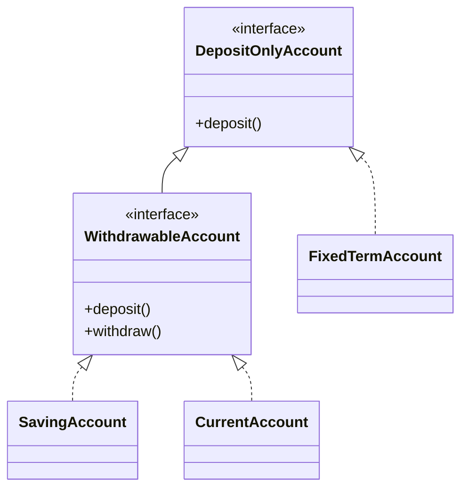
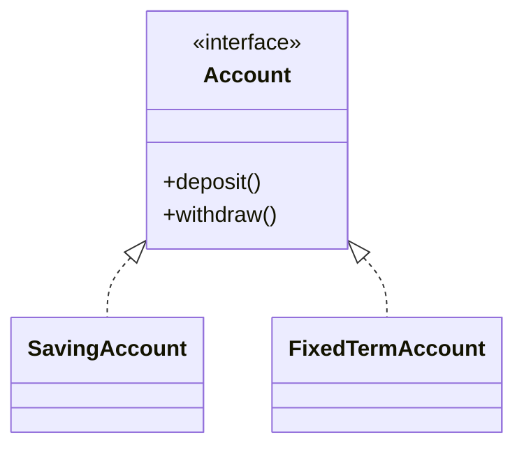

# Valid UML 

```mermaid
classDiagram

class DepositOnlyAccount {
    <<interface>>
    +deposit()
}

class WithdrawableAccount {
    <<interface>>
    +deposit()
    +withdraw()
}

class SavingAccount
class CurrentAccount
class FixedTermAccount

DepositOnlyAccount <|-- WithdrawableAccount

WithdrawableAccount <|.. SavingAccount
WithdrawableAccount <|.. CurrentAccount
DepositOnlyAccount <|.. FixedTermAccount
```
# UML for Violated

```mermaid
classDiagram

class Account {
    <<interface>>
    +deposit()
    +withdraw()
}

class SavingAccount
class FixedTermAccount

Account <|.. SavingAccount
Account <|.. FixedTermAccount
```