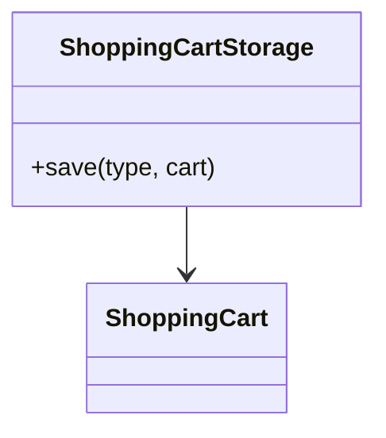
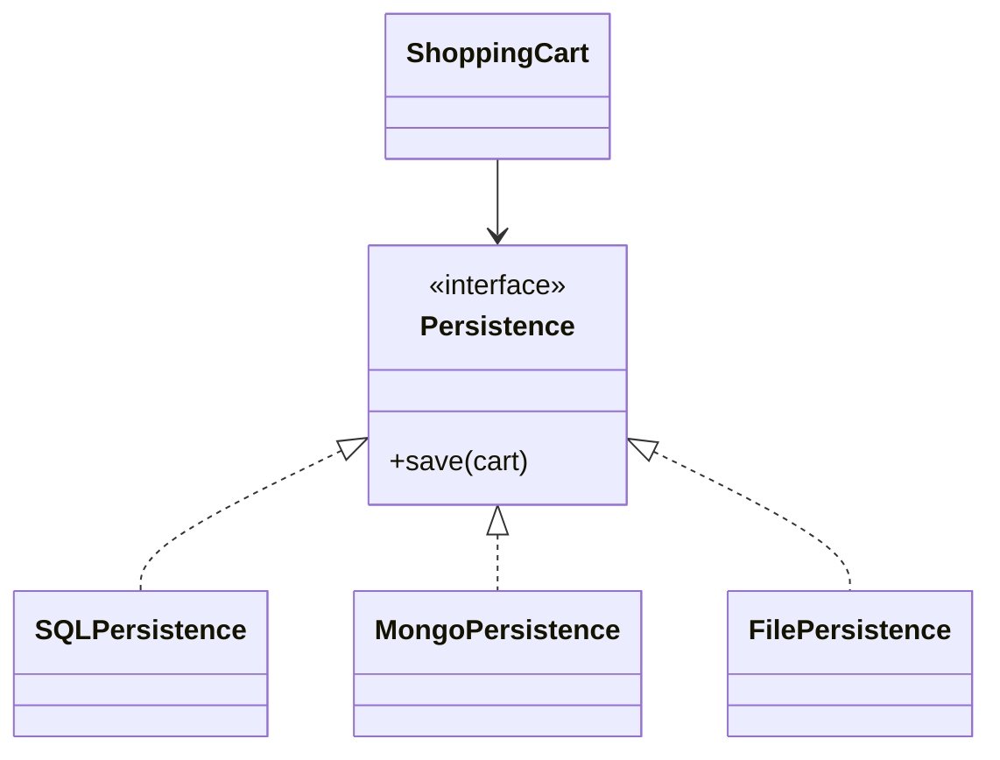

# Open Closed Principle (OCP)

## OCP Violated



**Problem:**

```text
save(type, cart)
{
    if(type == "SQL") ...
    else if(type == "Mongo") ...
    else if(type == "File") ...
}
```

Every new storage type requires modifying `ShoppingCartStorage`.

---

## OCP Followed



**Benefit:**

```text
class RedisPersistence implements Persistence
{
    save(cart)
}
```

New functionality is added by creating a new class, without modifying existing code.