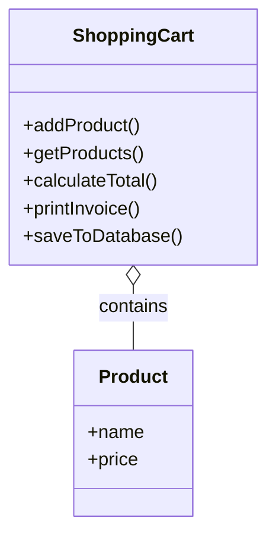
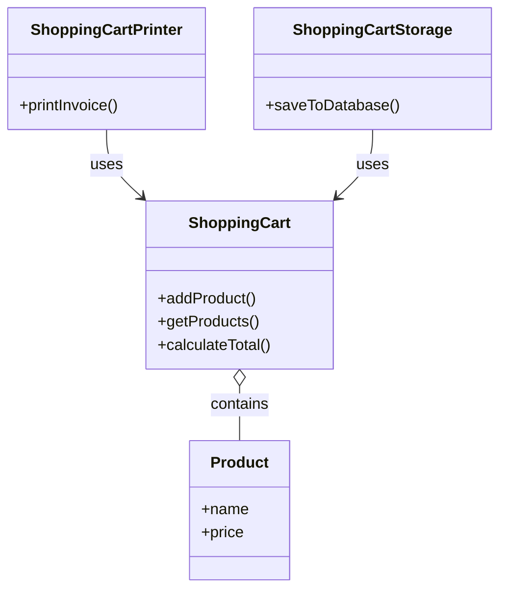

# Single Responsibility Principle (SRP)

## SRP Violated

**Issue:** ShoppingCart handles cart logic, invoice printing, and database storage.

---

## SRP Followed

**Benefit:**
- ShoppingCart → Cart management
- ShoppingCartPrinter → Invoice printing
- ShoppingCartStorage → Database operations

**SRP:** Each class has only one responsibility and one reason to change.