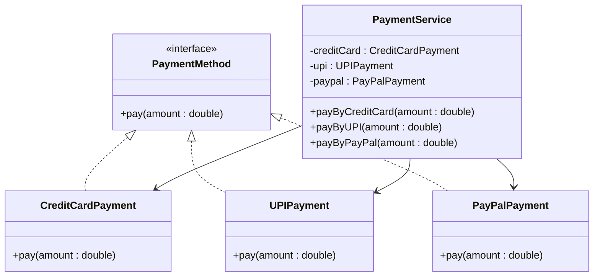

```mermaid
classDiagram

class PaymentMethod {
    <<interface>>
    +pay(amount : double)
}

class CreditCardPayment {
    +pay(amount : double)
}

class UPIPayment {
    +pay(amount : double)
}

class PayPalPayment {
    +pay(amount : double)
}

class PaymentService {
    -creditCard : CreditCardPayment
    -upi : UPIPayment
    -paypal : PayPalPayment
    +payByCreditCard(amount : double)
    +payByUPI(amount : double)
    +payByPayPal(amount : double)
}

PaymentMethod <|.. CreditCardPayment
PaymentMethod <|.. UPIPayment
PaymentMethod <|.. PayPalPayment

PaymentService --> CreditCardPayment
PaymentService --> UPIPayment
PaymentService --> PayPalPayment
```