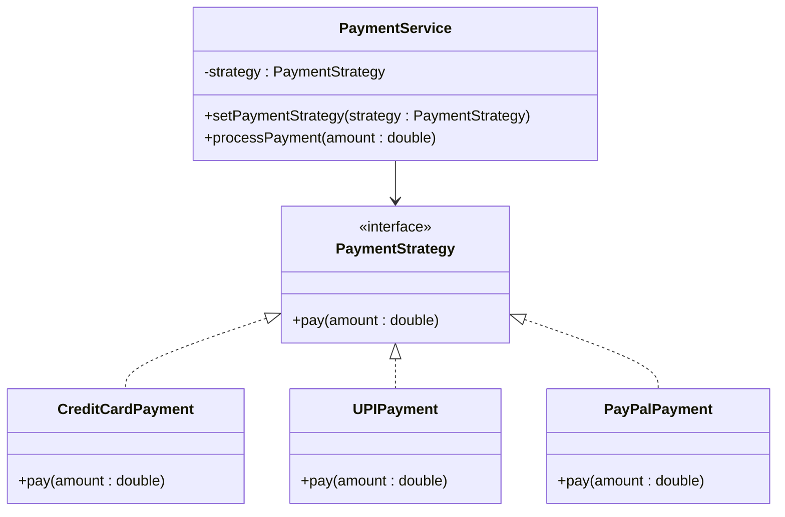

```mermaid
classDiagram

class PaymentStrategy {
    <<interface>>
    +pay(amount : double)
}

class CreditCardPayment {
    +pay(amount : double)
}

class UPIPayment {
    +pay(amount : double)
}

class PayPalPayment {
    +pay(amount : double)
}

class PaymentService {
    -strategy : PaymentStrategy
    +setPaymentStrategy(strategy : PaymentStrategy)
    +processPayment(amount : double)
}

PaymentStrategy <|.. CreditCardPayment
PaymentStrategy <|.. UPIPayment
PaymentStrategy <|.. PayPalPayment

PaymentService --> PaymentStrategy
```