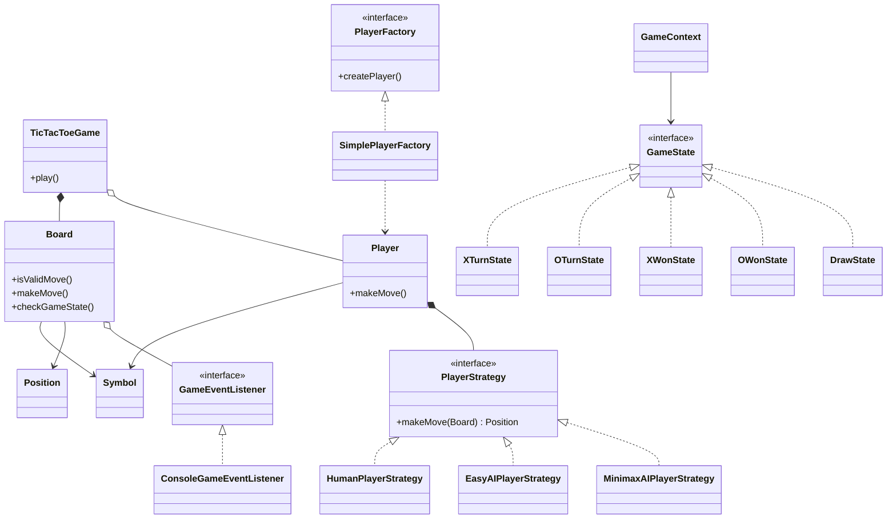

```mermaid
classDiagram

%% =====================
%% CORE GAME
%% =====================

class TicTacToeGame {
    +play()
}

class Board {
    +isValidMove()
    +makeMove()
    +checkGameState()
}

class Player {
    +makeMove()
}

class Position
class Symbol

TicTacToeGame *-- Board
TicTacToeGame o-- Player

Player --> Symbol
Board --> Symbol
Board --> Position

%% =====================
%% STRATEGY PATTERN
%% =====================

class PlayerStrategy {
    <<interface>>
    +makeMove(Board) Position
}

class HumanPlayerStrategy
class EasyAIPlayerStrategy
class MinimaxAIPlayerStrategy

Player *-- PlayerStrategy

PlayerStrategy <|.. HumanPlayerStrategy
PlayerStrategy <|.. EasyAIPlayerStrategy
PlayerStrategy <|.. MinimaxAIPlayerStrategy

%% =====================
%% FACTORY PATTERN
%% =====================

class PlayerFactory {
    <<interface>>
    +createPlayer()
}

class SimplePlayerFactory

PlayerFactory <|.. SimplePlayerFactory
SimplePlayerFactory ..> Player

%% =====================
%% STATE PATTERN
%% =====================

class GameContext

class GameState {
    <<interface>>
}

class XTurnState
class OTurnState
class XWonState
class OWonState
class DrawState

GameContext --> GameState

GameState <|.. XTurnState
GameState <|.. OTurnState
GameState <|.. XWonState
GameState <|.. OWonState
GameState <|.. DrawState

%% =====================
%% OBSERVER PATTERN
%% =====================

class GameEventListener {
    <<interface>>
}

class ConsoleGameEventListener

GameEventListener <|.. ConsoleGameEventListener

Board o-- GameEventListener
```